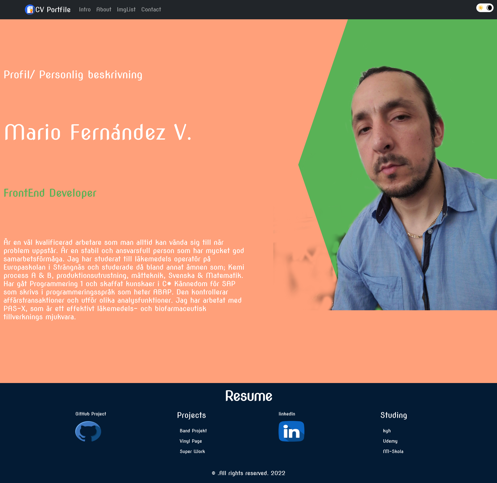

# cv-portfolio
Cv-Portfolio JS2-project

## HI 🎶 🤙 👋

I'm Mario from Sweden I studying for Front End development.
I enjoy learning what I have bean studyng for some time now.
It has bean a fun time learning about new languages and frameworks like rect.
This will be the first projec and hopefully not the las theat i startet doing with react.

. Now I'm creating a nice CV portfolio and simple GitHub Readme files.

 
 

###Skills:  REACT / JS / HTML / CSS

        

  

  

  
